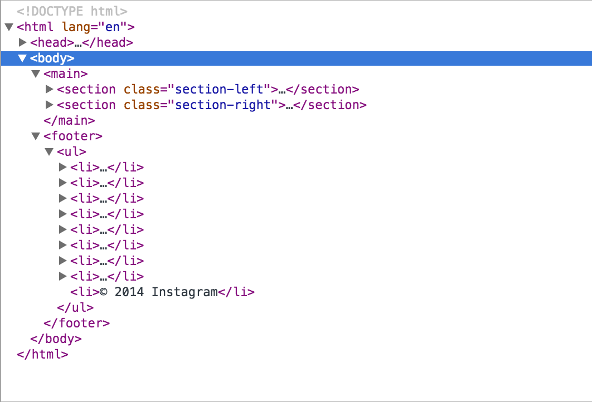

# DOM Manipulation

## Objectives
- Use `document` to manipulate html
- Bridge together `javascript` and `html` and `css`

## Requirements
- Indepth understanding of functions
- Basic understanding of objects
- Use if/switch

## DOM Introduction (15min)

### What Is Dom
DOM stands Document Object Model.

DOM is a description of a website (HTML) and it defines the relationship each element has with another. Below is a picture giving a short overview of a table


Another way to visualize this is using the `Element` tab in chrome. You will see arrows on the left and by expanding it it will tell you how the `inner html` is constructed and allow us to have a `parent & child` relationship



Now that we have this structure, we can now apply `css` and find specific element using `javascript`

Another concept to get a hold that that the DOM is actually not your html. What this mean is that DOM is something that looks like your HTML. But in some cases, it will not look the same. For example, there are mistakes in your HTML and the browser has fixed them for you. Let's say you have a <table> element in your HTML and leave out the required <tbody> element. The browser will just insert that <tbody> for you.

### What we do to DOM using Javascript
Since DOM server as a bridge between `javascript` and `html`, we can actually use `javascript` to manipulate the `DOM` to manipulate our webpage or we can simply `retrieve` information from `html` using `javascript`.

If you go to [this link](http://www.w3schools.com/jsref/dom_obj_document.asp) you can see all of DOM's methods available in our browser. By using these methods, you can add, remove, and edit new `element & attributes`. You can return a array of `img` if your document. You can target specific `class` or `id` and retrieve its underlying `html`. And many more things.

## Codealong (10min)
Lets start by retrieving all the `div` in a our [Lab: CSS Site Replication](https://github.com/wdi-hk-9/lab-css-site-replication)'s `solution-code/index.html`

`var x = document.getElementsByTagName('li')`

This will return us an array of `nodes` that represent our `html element`

If we go to [this link](http://www.w3schools.com/jsref/dom_obj_all.asp) we will be able to see methods that we can use on specific `node`. For example, `someNodeElement.innerHTML` returns you a string that is inside an element. Like `"hello world"` in `<div>hello world</div>`. Or it allows you to change the content by passing it a string variable like `someNodeElement.innerHTML = "destroy the world"`

You can also `chain` multiple methods. such as `var firstChildOfChildOfFooter = document.getElementsByTagName('footer')[0].firstElementChild.firstElementChild`

## Independence Practice (15min)
Head to these two link. [this link](http://www.w3schools.com/jsref/dom_obj_document.asp) to see all the methods there is for `document` and [this link](http://www.w3schools.com/jsref/dom_obj_all.asp) to see all the methods there are for `specific node`.

Spend sometime adding new elements, editing new elements, deleting elements.

Get very familiar with these specific `document methods`.

``` javascript
document.getElementById()
document.getElementsByClassName()
document.getElementsByTagName()
```

Get very familar with these specific `node methods`.

``` javascript
someNodeElement.getAttribute()
someNodeElement.innerHTML
someNodeElement.style
someNodeElement.className
```

## Useful Methods

### document.getElementById("your-id")

getElementById will get you the node by passing in an `id` as a string

``` html
<h1 id="hello">hello world</h1>
```

``` javascript
var node = document.getElementById("hello"); // This will give you the node with ID "hello"
```

### document.getElementByClassName("your-class")

getElementByClassName will get you an array of nodes by passing in a `class` as a string

``` html
<h1 class="title">title 1</h1>
<h1 class="title">title 2</h1>
<h1 class="title">title 3</h1>
```

``` javascript
var nodes = document.getElementById("title"); // This will give you an array of node with class "title"
```

### document.getElementByTagName("your-tag")

getElementByTagName will get you an array of nodes by passing in a `tag` as string

``` html
<h1 class="title">title 1</h1>
<h1 class="title">title 2</h1>
<h1 class="title">title 3</h1>
```

``` javascript
var nodes = document.getElementByTagName("h1"); // This will give you an array of node with tag "h1"
```

### node.innerHTML
`node.innerHTML` get/set the inner html of a node

``` html
<h1 id="hello">hello world</h1>
```

``` javascript
var node = document.getElementById("hello");

// get
var myInnerHTML = node.innerHTML; // This will give you a string "hello world"

// set
node.innerHTML = "destroy the world"; // This will set the innerHTML by passing in a string
```

### node.value
`node.value` get/set the value of an input tag

``` html
<input type="number" id="my-input">
```

``` javascript
var node = document.getElementById("my-input");

// get
var myInput = node.value; // This will give you a string regardless of input type

// set
node.value = 200; // This will set the value by passing in a string/number 
```

### node.setAttribute("the-attribute", "your-value")
`node.setAttribute` sets the value of a node

``` html
<div class="hide" id="unhide-me">
  <h1>"hello world"</h1>
</div>
```

``` javascript
var node = getElementById("unhide-me");

// remove hide from class
node.setAttribute("class", "");

// add hide to class
node.setAttribute("class", "hide");
```

### node.addEventListener("your-event", your-function)
`node.addEventListener` will now `listen` for specific event. When the event is triggered, it will run the function you specified

``` html
<button id="alert-button">alert!</button>
```

``` javascript
var node = getElementById("alert-button");

// add a listener to the node
node.addEventListener("click", function () {
  alert("ALERT!!!!!!");
})

// another way
var myFunction = function () {
  alert("ALERT!!!!!!");
}

node.addEventListener("click", myFunction);
```

### Event In Function As Parameter
the `node.addEventListener("your-event", your-function)` will automatically pass in a parameter `event` into your function. This `event` is an object that contains the properties of the `node` that was binded to the `event listener`. This means that you will now gain the ability to know which element you clicked onto!!!!!!

Following is an example code to `target` the node inside your function

``` html
<button id="alert-button">alert!</button>
```

``` css
.black-background {
  background-color: black;
}
```

``` javascript
var node = getElementById("alert-button");

// add a listener to the node
// also passes in 'event' as parameter to the function
node.addEventListener("click", function (event) {

  // you can try console.log(event) to see what it contains
  // it should contain the x&y position of the node, it's attributes...etc.
  console.log(event)
  
  // you can also target the node that your event listener was binded to
  // this means that event.target is equal to node
  // event.target == node // true
  // You can now know which element you clicked on!!!!
  // So now do whatever you want to "the specific" node you clicked onto!!!!
  event.target.setAttribute("class", "black-background")

  alert("ALERT!!!!!!");
})
```
