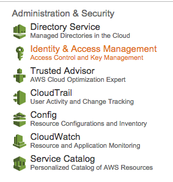
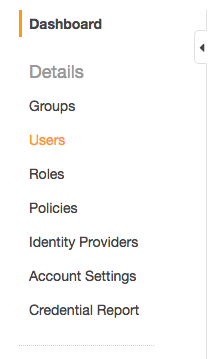
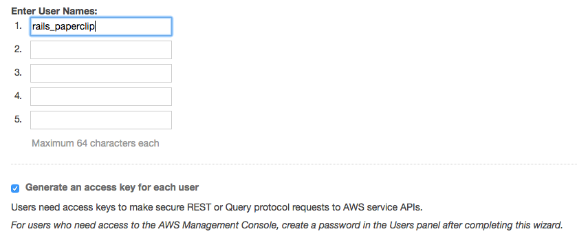
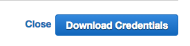
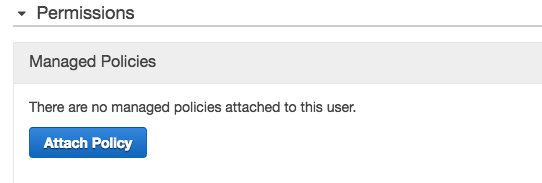
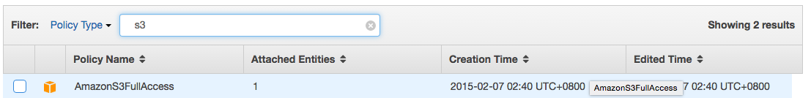
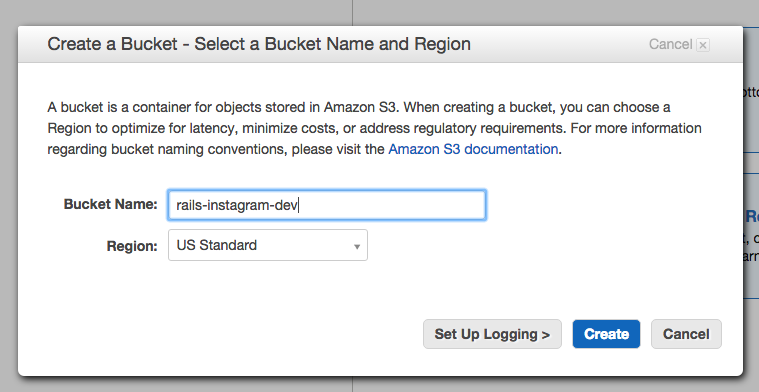

## File / Image Uploading
#### Using `paperclip` and `aws` to upload to AWS

##### 1. Configure AWS IAM

1.1 Configure Identity & Access Management (IAM) in S3



1.2 Add Users in IAM



1.3 Add one user name



1.4 Download the credentials for that user



1.5 Attach a policy to that user



1.6 Add S3 full access policy for that user



##### 2. Add a S3 Bucket



##### 3. Add `aws-sdk` gem

In `Gemfile`,

```ruby
gem 'aws-sdk'
```

##### 4. Configure `config/environments/development.rb` and `config/environments/production.rb`

In both `config/environments/development.rb` and `config/environments/production.rb`,

```ruby
Rails.application.configure do
  ...

  config.paperclip_defaults = {
    :storage => :s3,
    :s3_credentials => {
      :bucket => 'rails-instagram-dev',
      access_key_id: ENV['AWS_ACCESS_KEY_ID'],
      secret_access_key: ENV['AWS_SECRET_ACCESS_KEY']
    }
  }
end
```

##### 5. Configure local environment variables using `dotenv-rails`

We already included the gem in `Gemfile`,

```ruby
group :development, :test do
  ..

  gem "dotenv-rails"

  ...
end
```

To set **local** environment variables, create a file called `.env` and gitignore it.

In `.env`,

```
AWS_ACCESS_KEY_ID=YOUR_KEY_ID
AWS_SECRET_ACCESS_KEY=YOUR_ACCESS_KEY
```

To set **Heroku** environment variables, 


```
$ heroku config:set AWS_ACCESS_KEY_ID=YOUR_KEY_ID
$ heroku config:set AWS_SECRET_ACCESS_KEY=YOUR_ACCESS_KEY
```